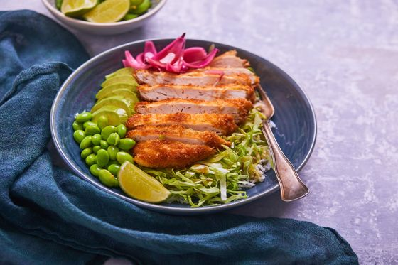

# Poke Bowl mit knusprigem Huhn

<figure><figcaption></figcaption></figure>

## Zutaten für 4 Portion(en)

200 g Sushi- oder Jasminreis 1 rote Zwiebel\
50 ml Essig\
50 ml Wasser

50 g Zucker\
4 Hühnerlets\
3 EL Weizenmehl\
2 TL Currypulver\
1 Ei, verquirlt\
200 g Kikkoman Panko - Knuspriges Paniermehl nach Japanischer Art\
1⁄2 kleiner Spitzkohl\
2 Avocados\
200 g Edamame-Bohnen (geschält)\
2 EL Kikkoman Sauce für Poke Bowls 1 Limette

Reis nach Packungsanweisung garen. Etwas abkühlen lassen, dann auf 4 Schüsseln verteilen.

Zwiebel in Spalten schneiden. Wasser, Essig und Zucker zum Kochen bringen und die Zwiebelspalten darin 1 Minute köcheln lassen. Die Hitze abschalten und Zwiebelspalten mindestens 15 Minuten im Kochwasser lassen.

Hühnerfilets klopfen, um gleichmäßige Scheiben von ca. 1 cm Dicke zu erhalten. Die Hühnerfilets auf beiden Seiten mit Mehl bestäuben und mit Salz, Pfeffer und Currypulver würzen. Das Fleisch im verquirlten Ei und anschließend in Paniermehl wenden und in Öl auf jeder Seite ca. 5 Minuten braten, überschüssiges Fett auf einem Küchenpapier abtropfen lassen und dann in Scheiben schneiden.

Edamame-Bohnen 1 Minute lang blanchieren. Den Kohl in dünne Scheiben schneiden und mit der Kikkoman Sauce für Poke Bowls vermischen. Avocados in Scheiben schneiden.

Kohl, Avocados, Edamame-Bohnen, eingelegte Zwiebeln und Huhn auf den Reis geben. Dazu extra Kikkoman Sauce für Poke Bowls und Limettenspalten als Beilage servieren.

Source: [https://www.kikkoman.at/rezepte/kikkoman-rezept-abo/rezept-abo-at/recipe-subscription/](https://www.kikkoman.at/rezepte/kikkoman-rezept-abo/rezept-abo-at/recipe-subscription/)
